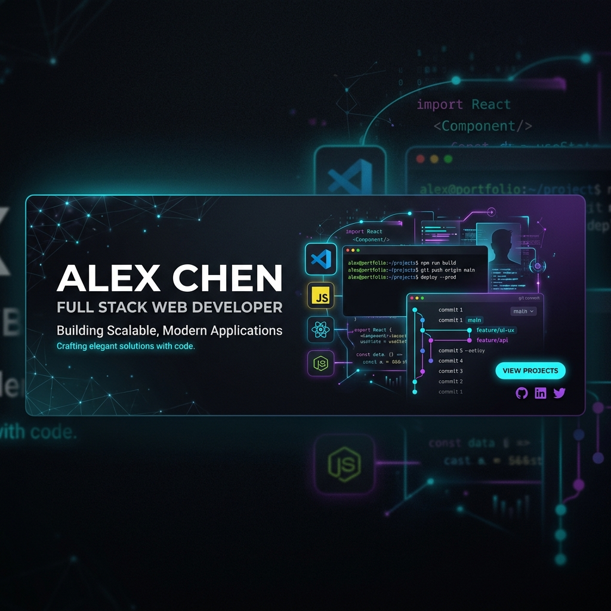

<div align="center">
  
  
  # 🚀 Amruth's Cinematic Developer Portfolio
  
  **An immersive, high-fidelity digital experience crafted for the modern web.**
  
  [](https://nextjs.org/)
  [](https://react.dev/)
  [](https://www.typescriptlang.org/)
  [](https://tailwindcss.com/)
  [](https://www.framer.com/motion/)

  [**Live Demo**](https://your-portfolio-link.vercel.app/) • [**Report Bug**](https://github.com/AmruthAmruth/Amruth-Portfolio/issues) • [**Request Feature**](https://github.com/AmruthAmruth/Amruth-Portfolio/issues)
</div>

---

## 🎭 The Cinematic Experience

This isn't just a portfolio; it's a developer's workspace brought to life. Designed with a focus on **visual excellence** and **interactive storytelling**, the site takes you through three distinct developer environments:

### 🖥️ 1. The Terminal Landing (`system_profile.sh`)
The journey begins at the source. A high-fidelity terminal interface that sets the stage for a technical deep-dive. It uses custom typing effects and motion triggers to create a "boot-up" feel.

### 📝 2. The VS Code Explorer (`src/projects`)
Your projects deserve more than just cards. They are presented within a pixel-perfect replication of a VS Code environment, complete with:
- **Interactive File Tree**: Browse projects like you're in the IDE.
- **JSON Editor View**: High-fidelity syntax highlighting and code structure.
- **Status Bar & Activity Bar**: Authentic IDE UI elements for maximum immersion.

### 📜 3. The Git Journey (`git log --graph`)
Experience professional growth through a realistic GitHub-style commit log. Every milestone is a commit, every project is a branch.

---

## 🏗️ Featured Engineering Feats

The portfolio showcases three core architectural modules:

1. **[Stratify](https://github.com/AmruthAmruth/Stratify)**: A multi-tenant SaaS project management platform featuring **AsyncLocalStorage** for strict data isolation and **Clean Architecture**.
2. **[Speedo](https://github.com/AmruthAmruth/Speedo)**: A high-performance GPS analytics system processing thousands of coordinates using **Node.js Streams** and GIS visualization.
3. **[FashionZone](https://github.com/AmruthAmruth/FashionZone)**: A full-stack E-commerce engine with complex payment recovery flows and integrated admin management.

---

## 🧠 Engineering Philosophy

- **Clean Architecture**: Separation of concerns between business logic, infrastructure, and delivery mechanisms.
- **Type-Safe Systems**: Leveraging TypeScript across the full stack to ensure resilience and maintainability.
- **User-Centric Design**: Building interfaces that aren't just functional, but cinematic and engaging.

---

## ⚙️ Quick Start

### Prerequisites
- Node.js 18.x or higher
- npm / yarn / pnpm

### Installation
1. **Clone the repository**
   ```bash
   git clone https://github.com/AmruthAmruth/Amruth-Portfolio.git
   cd Amruth-Portfolio
   ```

2. **Install dependencies**
   ```bash
   npm install
   ```

3. **Set up environment variables**
   Create a `.env.local` file in the root directory and add your credentials:
   ```env
   NEXT_PUBLIC_EMAILJS_SERVICE_ID=your_service_id
   NEXT_PUBLIC_EMAILJS_TEMPLATE_ID=your_template_id
   NEXT_PUBLIC_EMAILJS_PUBLIC_KEY=your_public_key
   ```

4. **Run the development server**
   ```bash
   npm run dev
   ```

---

## 📂 Project Structure

```bash
.
├── app/                # Next.js App Router (The Engine)
├── components/         # Modular React Components
│   ├── sections/       # High-fidelity page segments
│   └── shared/         # Reusable UI primitives (IDE elements, forms)
├── constants/          # Configuration & Static Data (The Source)
├── lib/                # Core Utilities & SDK wrappers
├── public/             # Cinematic Assets & Media
└── theme/              # Design System & Motion Tokens
```

---

## ✨ Features

- 🌑 **Dynamic Dark/Light Mode**: Seamless transitions between workspace themes.
- 🎬 **Motion Mastery**: Complex animations powered by Framer Motion 12.
- 📱 **Universal Responsiveness**: Optimized for every screen size, from mobile to ultra-wide.
- 📧 **Transmission Form**: Custom-built contact bridge integrated with EmailJS.

---

<div align="center">
  <p>Built with ❤️ by <b>Amruth</b></p>
  <p><i>Pushing the boundaries of what a web portfolio can be.</i></p>
</div>
